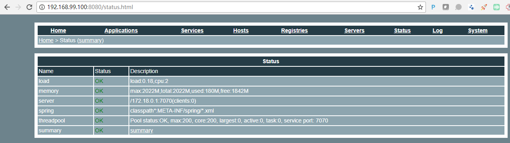

# 监控中心安装

## 下载源码

```bash
wget https://github.com/alibaba/dubbo/archive/dubbo-2.6.0.zip
unzip dubbo-2.6.0.zip
cd dubbo-dubbo-2.6.0/
```

## 编译源码

```bash
docker run -it --rm --name my-maven-project -v "$PWD":/usr/src/mymaven -w /usr/src/mymaven maven:3.2-jdk-8 mvn clean install
```

## 拷贝运行文件并解压

```bash
cp dubbo-dubbo-2.6.0/dubbo-simple/dubbo-monitor-simple/target/dubbo-monitor-simple-2.6.0-assembly.tar.gz /vagrant/dubbo/monitor/dubbo-monitor.tar.gz
cd /vagrant/dubbo/monitor/
tar xf dubbo-monitor.tar.gz
cd /vagrant/dubbo/monitor/dubbo-monitor-simple-2.6.0/conf
```

## 修改dubbo.properties文件

```bash
dubbo.container=log4j,spring,registry,jetty
dubbo.application.name=simple-monitor
dubbo.application.owner=
#dubbo.registry.address=multicast://224.5.6.7:1234
#dubbo.registry.address=zookeeper://127.0.0.1:2181
dubbo.registry.address=redis://127.0.0.1:6379
#dubbo.registry.address=dubbo://127.0.0.1:9090
dubbo.protocol.port=7070
dubbo.jetty.port=8080
dubbo.jetty.directory=${user.home}/monitor
dubbo.charts.directory=${dubbo.jetty.directory}/charts
dubbo.statistics.directory=${user.home}/monitor/statistics
dubbo.log4j.file=logs/dubbo-monitor-simple.log
dubbo.log4j.level=WARN

```

## 启动

```bash
bin/start.sh
```

## 访问

http://192.168.99.100:8080

