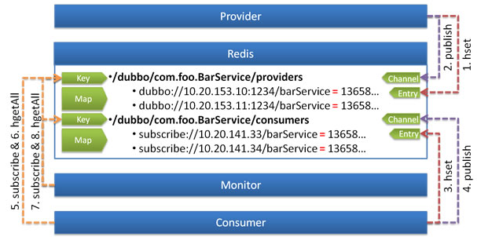

------------------

# Redis 注册中心



使用 Redis 的 Key/Map 结构存储数据结构：

- 主 Key 为服务名和类型
- Map 中的 Key 为 URL 地址
- Map 中的 Value 为过期时间，用于判断脏数据，脏数据由监控中心删除 [3](http://dubbo.io/books/dubbo-user-book/references/registry/redis.html#fn_3)

使用 Redis 的 Publish/Subscribe 事件通知数据变更：

- 通过事件的值区分事件类型：`register`, `unregister`, `subscribe`, `unsubscribe`
- 普通消费者直接订阅指定服务提供者的 Key，只会收到指定服务的 `register`, `unregister` 事件
- 监控中心通过 `psubscribe` 功能订阅 `/dubbo/*`，会收到所有服务的所有变更事件

调用过程：

1. 服务提供方启动时，向 `Key:/dubbo/com.foo.BarService/providers` 下，添加当前提供者的地址
2. 并向 `Channel:/dubbo/com.foo.BarService/providers` 发送 `register` 事件
3. 服务消费方启动时，从 `Channel:/dubbo/com.foo.BarService/providers` 订阅 `register` 和 `unregister` 事件
4. 并向 `Key:/dubbo/com.foo.BarService/providers` 下，添加当前消费者的地址
5. 服务消费方收到 `register` 和 `unregister` 事件后，从 `Key:/dubbo/com.foo.BarService/providers` 下获取提供者地址列表
6. 服务监控中心启动时，从 `Channel:/dubbo/*` 订阅 `register` 和 `unregister`，以及 `subscribe`和`unsubsribe`事件
7. 服务监控中心收到 `register` 和 `unregister` 事件后，从 `Key:/dubbo/com.foo.BarService/providers`下获取提供者地址列表
8. 服务监控中心收到 `subscribe` 和 `unsubsribe` 事件后，从 `Key:/dubbo/com.foo.BarService/consumers` 下获取消费者地址列表

## 配置

```
<dubbo:registry address="redis://10.20.153.10:6379" />

```

或

```
<dubbo:registry address="redis://10.20.153.10:6379?backup=10.20.153.11:6379,10.20.153.12:6379" />

```

或

```
<dubbo:registry protocol="redis" address="10.20.153.10:6379" />

```

或

```
<dubbo:registry protocol="redis" address="10.20.153.10:6379,10.20.153.11:6379,10.20.153.12:6379" />
```

## 选项

- 可通过 `<dubbo:registry group="dubbo" />` 设置 redis 中 key 的前缀，缺省为 `dubbo`。
- 可通过 `<dubbo:registry cluster="replicate" />` 设置 redis 集群策略，缺省为 `failover`：
  - `failover`: 只写入和读取任意一台，失败时重试另一台，需要服务器端自行配置数据同步
  - `replicate`: 在客户端同时写入所有服务器，只读取单台，服务器端不需要同步，注册中心集群增大，性能压力也会更大