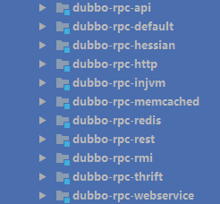

# Dubbo详细介绍与安装使用过程

[TOC]

## 介绍

### dubbox简介

随着互联网的发展，网站应用的规模不断扩大，常规的垂直应用架构已无法应对，分布式服务架构以及流动计算架构势在必行，亟需一个治理系统确保架构有条不紊的演进。


-  单一应用架构  当网站流量很小时，只需一个应用，将所有功能都部署在一起，以减少部署节点和成本。  此时，用于简化增删改查工作量的 数据访问框架(ORM) 是关键。 

-  垂直应用架构  当访问量逐渐增大，单一应用增加机器带来的加速度越来越小，将应用拆成互不相干的几个应用，以提升效率。  此时，用于加速前端页面开发的 Web框架(MVC) 是关键。 

-  分布式服务架构  当垂直应用越来越多，应用之间交互不可避免，将核心业务抽取出来，作为独立的服务，逐渐形成稳定的服务中心，使前端应用能更快速的响应多变的市场需求。  此时，用于提高业务复用及整合的 分布式服务框架(RPC) 是关键。 

-  流动计算架构  当服务越来越多，容量的评估，小服务资源的浪费等问题逐渐显现，此时需增加一个调度中心基于访问压力实时管理集群容量，提高集群利用率。  此时，用于提高机器利用率的 资源调度和治理中心(SOA) 是关键。

  ​

### dubbox是dubbo的扩展,当当网维护

1、支持REST风格远程调用（HTTP + JSON/XML)

2、支持基于Kryo和FST的Java高效序列化实现

3、支持基于Jackson的JSON序列化

4、支持基于嵌入式Tomcat的HTTP remoting体系

5、升级Spring

6、升级ZooKeeper客户端

7、支持完全基于Java代码的Dubbo配置

8、调整Demo应用

9、修正了dubbo的bug 包括配置、序列化、管理界面等等的bug


### dubbo架构构成

参见framwork_desc.pdf


## dubbo详细

### 调用方式

- 异步调用(默认的dubbo协议)

基于NIO的非阻塞实现并行调用，客户端不需要启动多线程即可完成并行调用多个远程服务，相对多线程开销较小。


- 本地调用（injvm协议）

本地调用，使用了Injvm协议，是一个伪协议，它不开启端口，不发起远程调用，只在JVM内直接关联，但执行Dubbo的Filter链。


- Http调用(hessian协议，http协议，webservice协议)

采用 Http 通讯，采用 Servlet 暴露服务，Dubbo 缺省内嵌 Jetty 作为服务器实现。


- RPC调用(memcached协议，redis协议，thrift协议)
- RMI调用（rmi协议）


### dubbo支持的注册中心

Dubbo提供的注册中心有如下几种类型可供选择：

- Multicast注册中心（见multicast_registry_center.pdf）
- Zookeeper注册中心 (见zookeeper_registry_center.pdf)
- Redis注册中心 (见redis_registry_center.pdf)
- Simple注册中心（mvn dubbo:registry -Dport=9099）

###dubbo支持的远程通信协议

远程通信需要指定通信双方所约定的协议，在保证通信双方理解协议语义的基础上，还要保证高效、稳定的消息传输。Dubbo继承了当前主流的网络通信框架，主要包括如下几个：


### dubbo支持的远程调用协议



使用RMI协议，一般会受到防火墙的限制，所以对于外部与内部进行通信的场景，就不要使用RMI协议，而是基于HTTP协议或者Hessian协议。


### dubbo集群容错和负载均衡

​	1、	**集群容错**  在集群调用失败时，Dubbo提供了多种容错方案，缺省为failover重试。

-  Failover Cluster  失败自动切换，当出现失败，重试其它服务器。(缺省)  通常用于读操作，但重试会带来更长延迟。  可通过retries=“2”来设置重试次数(不含第一次)。 

-  Failfast Cluster  快速失败，只发起一次调用，失败立即报错。  通常用于非幂等性的写操作，比如新增记录。 

-  Failsafe Cluster  失败安全，出现异常时，直接忽略。  通常用于写入审计日志等操作。 

-  Failback Cluster  失败自动恢复，后台记录失败请求，定时重发。  通常用于消息通知操作。 

-  Forking Cluster  并行调用多个服务器，只要一个成功即返回。  通常用于实时性要求较高的读操作，但需要浪费更多服务资源。  可通过forks=“2”来设置最大并行数。 

-  Broadcast Cluster  广播调用所有提供者，逐个调用，任意一台报错则报错。(2.1.0开始支持)  通常用于通知所有提供者更新缓存或日志等本地资源信息。

  ​

  2、**负载均衡**  - Random LoadBalance随机，按权重设置随机概率。  在一个截面上碰撞的概率高，但调用量越大分布越均匀，而且按概率使用权重后也比较均匀，有利于动态调整提供者权重。

-  RoundRobin LoadBalance 轮循，按公约后的权重设置轮循比率。  存在慢的提供者累积请求问题，比如：第二台机器很慢，但没挂，当请求调到第二台时就卡在那，久而久之，所有请求都卡在调到第二台上。 

-  LeastActive LoadBalance 最少活跃调用数，相同活跃数的随机，活跃数指调用前后计数差。  使慢的提供者收到更少请求，因为越慢的提供者的调用前后计数差会越大。 

-  ConsistentHash LoadBalance 一致性Hash，相同参数的请求总是发到同一提供者。  当某一台提供者挂时，原本发往该提供者的请求，基于虚拟节点，平摊到其它提供者，不会引起剧烈变动。


### dubbo配置

- XML 配置（见dubbo_config_xml.pdf）
- 属性配置（见dubbo_config_properties.pdf）
- API 配置(直接通过代码方式写入，不建议，见http://dubbo.io/books/dubbo-user-book/configuration/api.html)
- 注解配置（可以通过springboot引入，文档和代码还在完善）


###telnet命令（用作在线运维）

命令（参加http://dubbo.io/books/dubbo-user-book/references/telnet.html）

配置

​	dubbo.properties

```
dubbo.qos.port=33333
dubbo.qos.accept.foreign.ip=false --拒绝远端主机发出的命令，只允许服务本机执行
```

### 服务化最佳实践

参见http://dubbo.io/books/dubbo-user-book/best-practice.html

### 推荐用法

参见http://dubbo.io/books/dubbo-user-book/recommend.html

## 安装

### 启动zookeeper

参见video/start_zookeeper.swf

### 启动redis

参见video/start_redis.swf

### 启动provider和consumer

参见video/start_provider_consumer.swf

### 启动monitor

参见monitor_install.pdf

video/start_monitor.swf

### 启动admin

参见admin_install.pdf

video/start_admin.swf